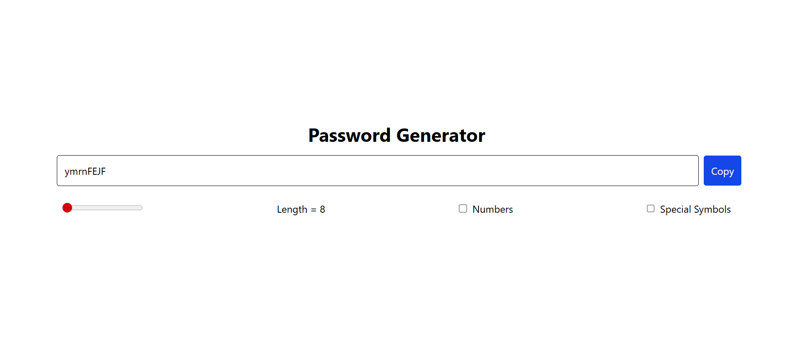

# 🔐 Password Generator


A simple and customizable **Password Generator** built using **React, Vite, and Tailwind CSS**.  
Deployed with **Vercel** for instant access.

---

## ✨ Features
- 🔑 Generate strong & secure passwords instantly
- 🎚️ Adjustable length (8–100 characters)
- 🔢 Option to include **Numbers**
- 🔣 Option to include **Special Symbols**
- 📋 One-click **Copy to Clipboard**
- 📱 Responsive & clean UI with Tailwind

---

## 🚀 Live Demo
👉 [View on Vercel](https://random-password-generator-amber-kappa.vercel.app/)  

---

## 🛠️ Tech Stack
- ⚛️ **React** (with Hooks – `useState`, `useEffect`)
- ⚡ **Vite** (for fast bundling & dev server)
- 🎨 **Tailwind CSS** (for styling)
- ▲ **Vercel** (for deployment)

---

## 📸 Screenshots
### Home Page
  

---

## ⚡ Getting Started

### 1️⃣ Clone the Repository
```bash
git clone https://github.com/imawadh/password-generator.git
cd password-generator
npm install
npm install tailwindcss @tailwindcss/vite
npm run dev
